# etos setup

## 0. 준비사항

### 1) 박스 구성도

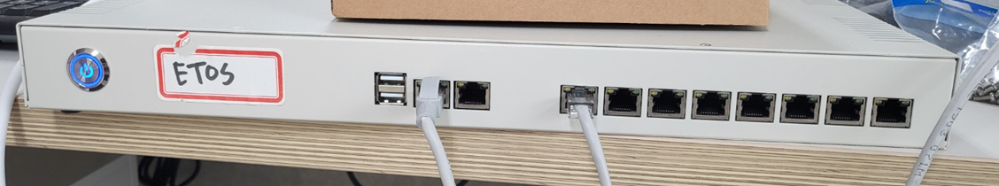

### 2) RS232 핀맵
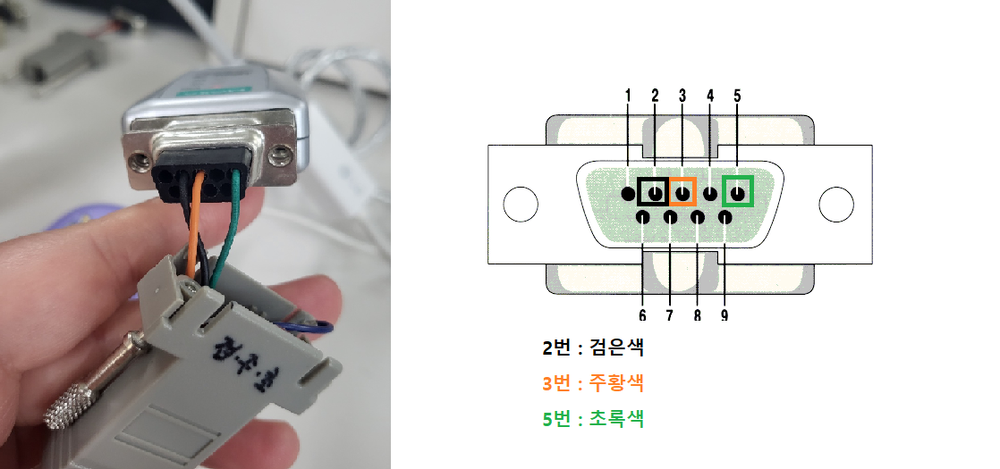

<<참고>>

## 1. **IP 설정**

### **1) BOX와 노트북 LAN 연결**
        노트북에 연결되어있는 LAN을 제거한다.

        제어판<네트워크 및 인터넷<네트워크 연결<이더넷<속성<인터넷 프로토콜 버전4(TCP/IPv4)

        다음 IP 주소 사용 : 
        IP 주소 : 192.168.0.113
        서브넷 마스크 : 255.255.255.0
        설정 후 확인을 누른다.((IP 주소는 다른 걸로 이용해도 됨.))

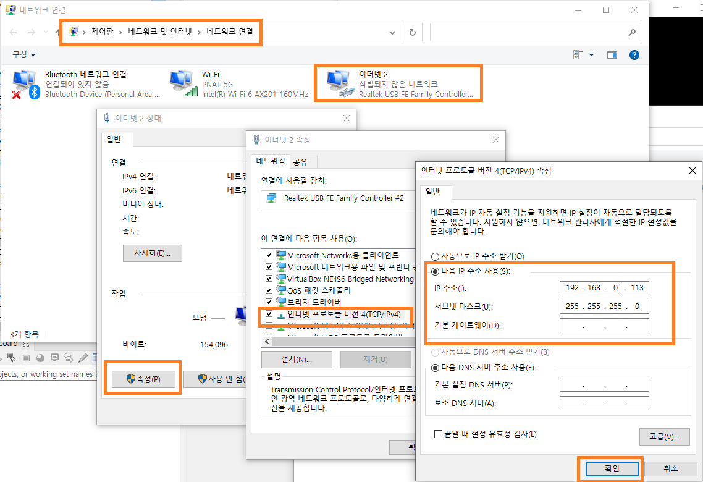

        설정이 완료 후 BOX에서의 LAN 1번과 노트북 LAN을 연결한다.

### **2) ssh 연결**
        putty 오픈 후 BOX의 IP를 입력 후, Open을 눌러준다.

        - LAN1 IP : 192.168.0.105    //고객사에서 할당 받은 BOX IP
        - LAN2 IP : 111.111.111.111  //IP 수정하지 말것

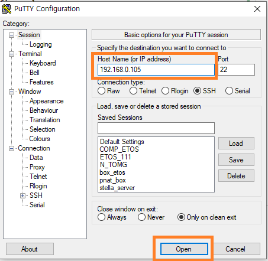

        계정의 ID와 비밀번호를 입력한다.
        - ID : etos
        - PW : etos

        - ID: pnat
        - PW: pnat

        - 관리자 비밀번호 : pnat

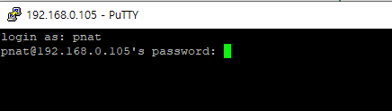

        su를 입력하여 admin 계정으로 로그인한다.
        
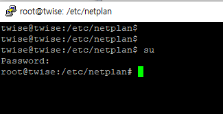

### **3) vi /etc/netplan/00-installer-config.yaml 파일에 들어간다.**
        vi /etc/netplan/00-installer-config.yaml

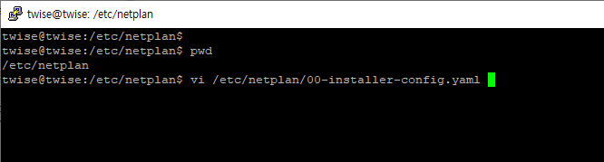

### **4) enp3s0(LAN 1번) 부분에 할당받은 IP를 넣어 준다**
        addresses: 할당받은 IP
        gatway4 : 할당받은 gateway 
        
        ex) box ip => 192.168.23.112
            box gateway => 192.168.23.1

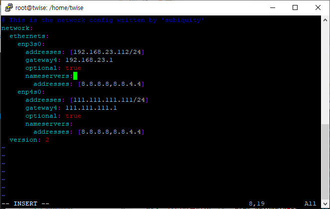

### **5) netplan apply 입력하여 ip를 업데이트 해준다.**
        netplan apply

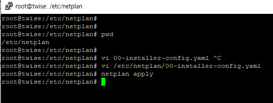

        연결이 끊기면 노트북의 ip를 수정하여 ssh가 연결이 되는지 확인한다.

        변경 된 BOX IP가 putty 프로그램을 이용하여 연결이 되는지 확인 한다.

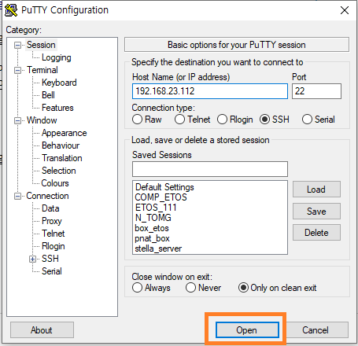

## 2. 기존 etos 디렉토리 전체 backup

        cp -rf /home/pnat/etos /home/pnat/etos_bak_`date '+%y%m%d'`
        
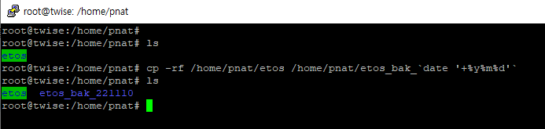

        ls -al /home/pnat/etos
        ls -al /home/pnat/etos_bak_`date '+%y%m%d'`

        입력하여 정상적으로 복사가 되었는지 확인한다

## 3. 파일 추가

아래의 파일을 다운로드 받아 압축을 풀어 놓는다.

[patchfile download](./2022_11_10/etos_221110.tar)
 

### 1) 패치파일 다운로드
    etos_221110.tar 압축을 풀어 해당 파일과 폴더를 /home/pnat/etos 파일질라를 이용하여 폴더에 넣는다.

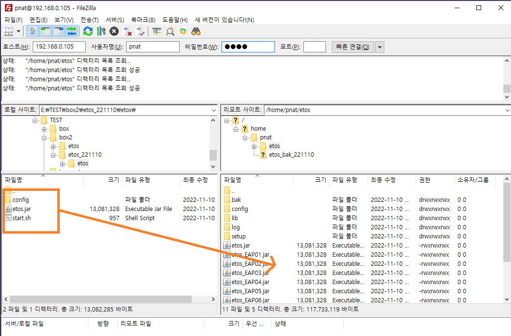

 ### 2) ssh 접속 후 etos_EAP01~08.jar 삭제 
    putty 프로그램을 이용하여 해당 박스에 접속한다.

    etos_EAP01~08.jar 삭제해준다.
    rm -rf /home/pnat/etos/etos_EAP*

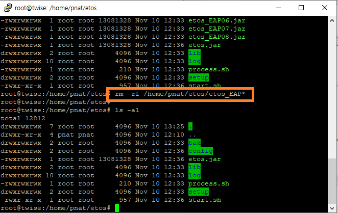

### 3)  etos.jar 를 복사하여 etos_EAP01~08.jar 항목추가
    etos.jar 를 복사하여 etos_EAP01~08.jar 항목으로 만든다.

    cp /home/pnat/etos/etos.jar /home/pnat/etos/etos_EAP01.jar
    cp /home/pnat/etos/etos.jar /home/pnat/etos/etos_EAP02.jar
    cp /home/pnat/etos/etos.jar /home/pnat/etos/etos_EAP03.jar
    cp /home/pnat/etos/etos.jar /home/pnat/etos/etos_EAP04.jar
    cp /home/pnat/etos/etos.jar /home/pnat/etos/etos_EAP05.jar
    cp /home/pnat/etos/etos.jar /home/pnat/etos/etos_EAP06.jar
    cp /home/pnat/etos/etos.jar /home/pnat/etos/etos_EAP07.jar
    cp /home/pnat/etos/etos.jar /home/pnat/etos/etos_EAP08.jar

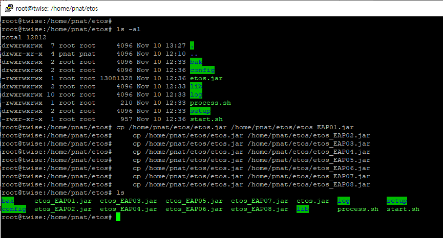
