# etos setup

## 0. 준비사항

### 1) 박스 구성도

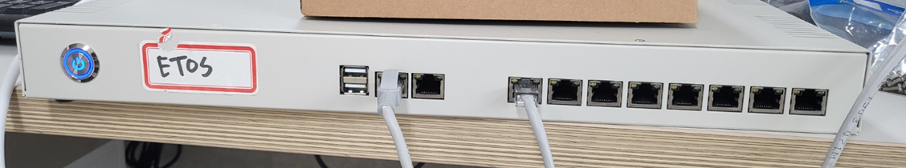

### 2) RS232 핀맵

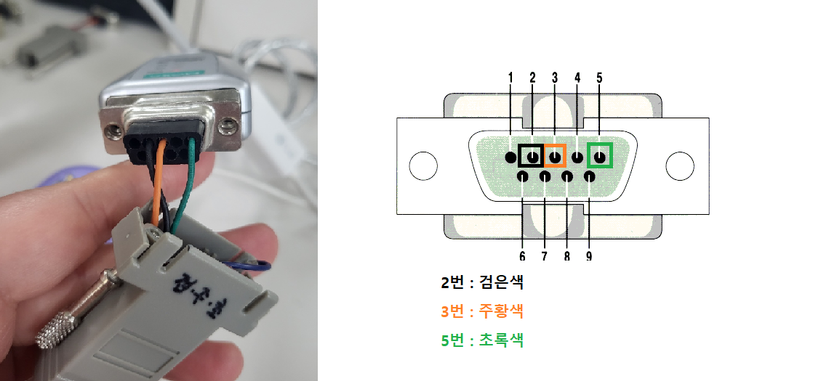

<<참고>>
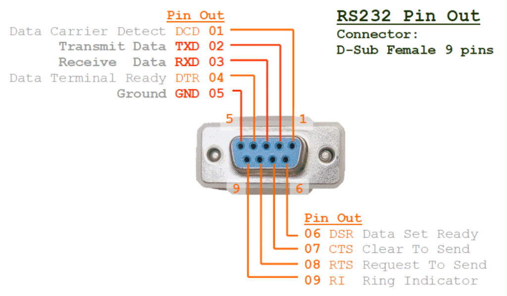

## 1. **IP 설정**

### **1) BOX와 노트북 LAN 연결**

        노트북에 연결되어있는 LAN을 제거한다.

        제어판<네트워크 및 인터넷<네트워크 연결<이더넷<속성<인터넷 프로토콜 버전4(TCP/IPv4)

        다음 IP 주소 사용 :
        IP 주소 : 192.168.0.113
        서브넷 마스크 : 255.255.255.0
        설정 후 확인을 누른다.((IP 주소는 다른 걸로 이용해도 됨.))

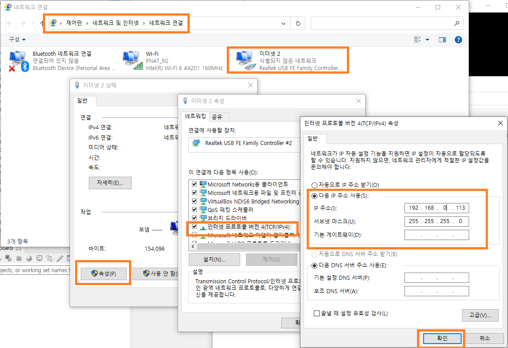

        설정이 완료 후 BOX에서의 LAN 1번과 노트북 LAN을 연결한다.

### **2) ssh 연결**

        putty 오픈 후 BOX의 IP를 입력 후, Open을 눌러준다.

        - LAN1 IP : 192.168.0.105    //고객사에서 할당 받은 BOX IP
        - LAN2 IP : 111.111.111.111  //IP 수정하지 말것

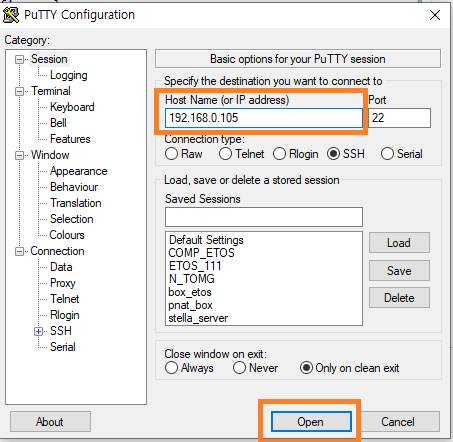

        계정의 ID와 비밀번호를 입력한다.
        - ID: twise
        - PW: master00

        - 관리자 비밀번호 : master00

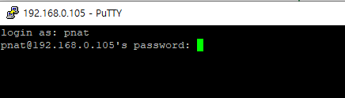

        su를 입력하여 admin 계정으로 로그인한다.

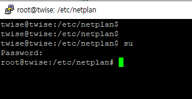

### **3) /home/twise/etos/setup/setip.sh 실행**

        /home/twise/etos/setup/setip.sh  IP GATEWAY  입력 후 구동시킨다
        ./
        ex)                      setip.sh IP            GATEWAY
          /home/twise/etos/setup/setip.sh 192.168.0.105 192.168.0.1

### **4) box를 재 실행시킨다.**

        reboot -f

### **4) 수정된 IP로 ssh 접근을 다시 한다**

## 3. 파일 다운로드 및 패치

아래의 파일을 다운로드 받아 압축을 풀어 놓는다.

[patchfile download](./2023_03_28/etos_patch_230330.zip)

### 1) 패치파일 다운로드

    etos_patch_날짜.zip 압축을 풀어 해당 파일과 폴더를 /home/twise/etos/patch 파일질라를 이용하여 폴더에 넣는다.

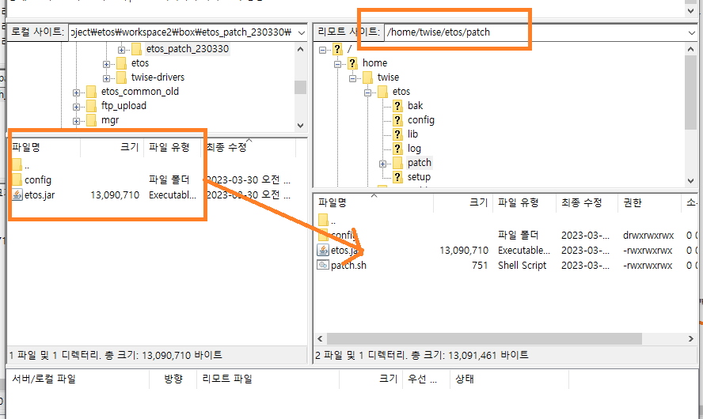

### 2) /home/twise/etos/patch/patch.sh을 구동시킨다.

        터미널에서 /home/twise/etos/patch/patch.sh 실행
        =====patch finished ==== 문구가 있는지 확인한다.

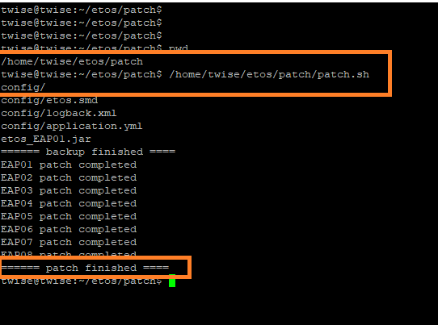

## 4. ETOS-RF 로그 확인 방법

        /home/twise/etos/log에서 EAP01~08 중 해당 되는 로그의 이름을 연다.
        실시간으로 log를 확인하고 싶을 땐 해당 로그 위치의 폴더에 들어가서
        tail -f EAP숫자.log 로 열어서 본다.

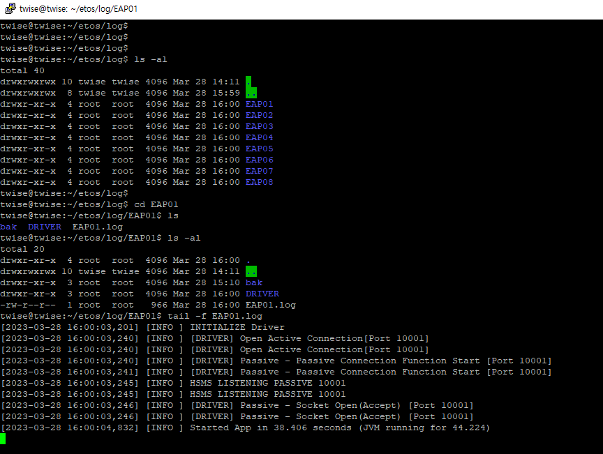

## 5. 프로세스 구동 되고 있는지 확인

        ps -ef | grep EAP

## 6. 로그레벨 지정

        /home/twise/etos/config/logback.xml
        테스트  -> DEBUG
        운영 ->  ERROR

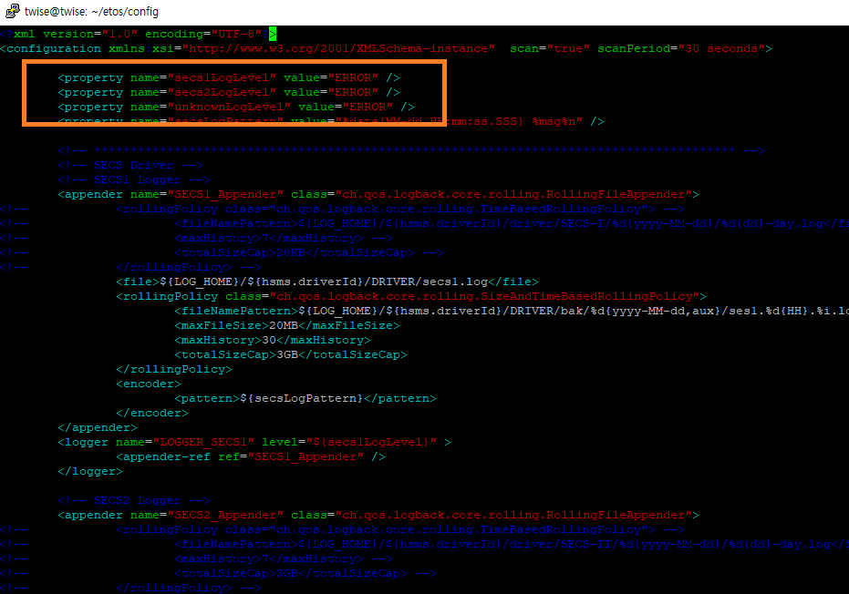

## 참고 1) IP 수동 설정

### **1) vi /etc/netplan/00-installer-config.yaml 파일에 들어간다.**

        vi /etc/netplan/00-installer-config.yaml

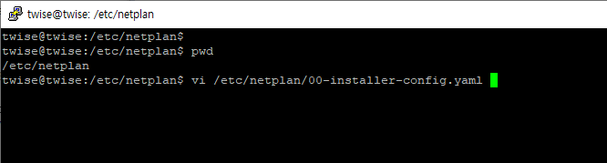

### **2) enp3s0(LAN 1번) 부분에 할당받은 IP를 넣어 준다**

        addresses: 할당받은 IP
        gatway4 : 할당받은 gateway

        ex) box ip => 192.168.23.112
            box gateway => 192.168.23.1

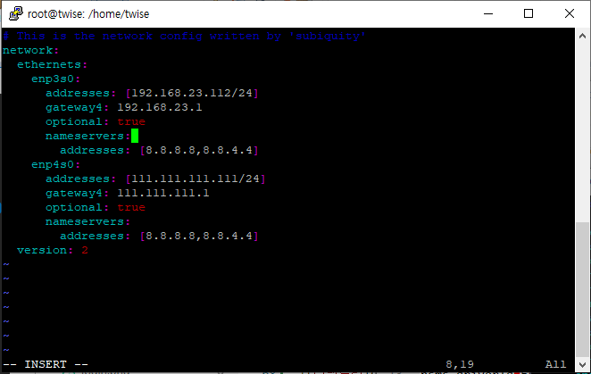

        <<vi 편집 참고>>
        vi 입력모드로 전환하기: 변경하고자 하는 커서에서 명령어 i 입력
        vi 입력모드 나가기: ESC키
        vi 저장하고 vi종료: ESC키 누른 후 :wq 입력
        vi 종료: :q! 입력

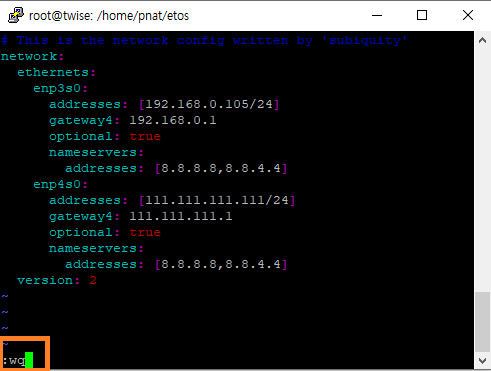

### **3) netplan apply 입력하여 ip를 업데이트 해준다.**

        netplan apply

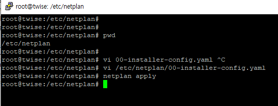

        연결이 끊기면 노트북의 ip를 수정하여 ssh가 연결이 되는지 확인한다.

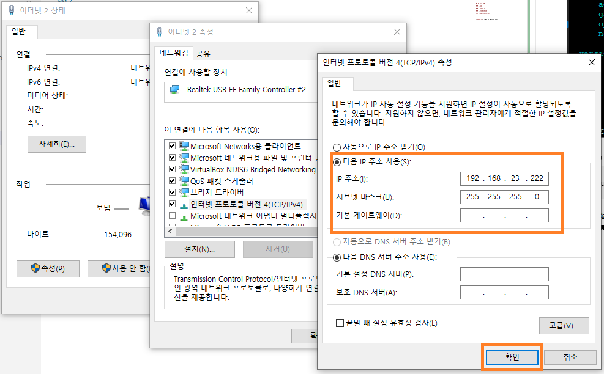

        변경 된 BOX IP가 putty 프로그램을 이용하여 연결이 되는지 확인 한다.

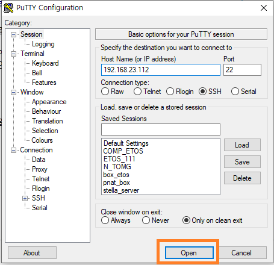

## 참고 2) 수동으로 패치 작업 방법

### 1) ssh 접속 후 etos_EAP01~08.jar 삭제

    putty 프로그램을 이용하여 해당 박스에 접속한다.

    etos_EAP01~08.jar 삭제해준다.
    rm -rf /home/twise/etos/etos_EAP*

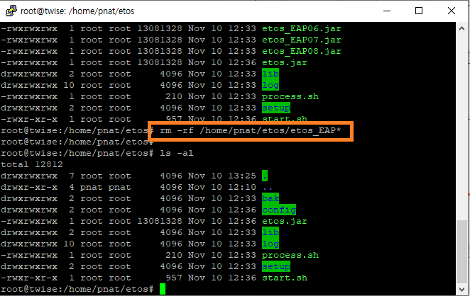

### 2) etos.jar 를 복사하여 etos_EAP01~08.jar 항목추가

    etos.jar 를 복사하여 etos_EAP01~08.jar 항목으로 만든다.

    cp /home/twise/etos/etos.jar /home/twise/etos/etos_EAP01.jar
    cp /home/twise/etos/etos.jar /home/twise/etos/etos_EAP02.jar
    cp /home/twise/etos/etos.jar /home/twise/etos/etos_EAP03.jar
    cp /home/twise/etos/etos.jar /home/twise/etos/etos_EAP04.jar
    cp /home/twise/etos/etos.jar /home/twise/etos/etos_EAP05.jar
    cp /home/twise/etos/etos.jar /home/twise/etos/etos_EAP06.jar
    cp /home/twise/etos/etos.jar /home/twise/etos/etos_EAP07.jar
    cp /home/twise/etos/etos.jar /home/twise/etos/etos_EAP08.jar

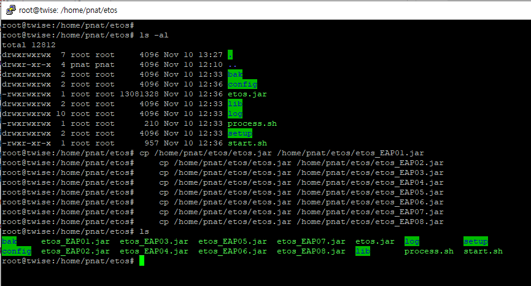
